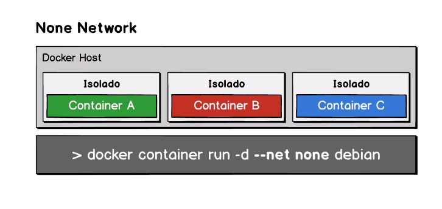
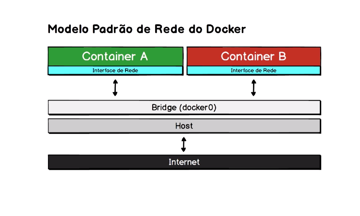

## Docker

#### Comandos de manipulação de imagens e container 
```shell
# Sobe container de nome 'python-server' da imagem 'ex-build-dev' com volume mapeado e porta interna 8000 redirecionada para a 80 do host
docker container run -it -v $(pwd):/app -p 80:8000 --name python-server ex-build-dev
# Sobe container de nome 'leitor-log' da imagem debian acessando os volumes do container 'python-server' exibindo conteúdo do arquivo http-server.log que está dentro do volume enxergado. 
docker container run -it --volumes-from=python-server --name leitor-log debian cat /log/http-server.log
```

#### Push image para o Docker Hub
```shell
#
# Dá um push de imagem para o Docker Hub
docker image tag <NameCurrentImage> <usernameDockerHub>/<NameImage:version>

```

#### Modelos de rede no Docker
Tipos e comandos
- None Network


- Bridge Network (Padrão)


- Host Network

- Overlay Network (Swarm)

Comandos
```shell
# Lista os tipos de redes disponíveis no Docker
docker network ls 
# Inspeciona uma determinada rede
docker network inspect bridge
# Sobe container da image alpine. Terminal ash executa o comando 'ifconfig'. Comando --rm deleta container em seguida.
docker container run --rm alpine ash -c "ifconfig"
# Sobe um container usolado da rede. Comando --rm deleta container em seguida.
docker container run --rm --net none ash -c "ifconfig"
```

Criando dois containers dentro de uma rede bridge
```shell
# Criando container1
docker container run -d --name container1 alpine sleep 1000
# Visualizando as configurações de rede do container1
docker container exec -it container1 ifconfig 
# Criando container2
docker container run -d --name container2 alpine sleep 1000
# Visualizando as configurações de rede do container2
docker container exec -it container2 ifconfig 
# Testando conectividade de um container com a rede externa. Ex: ping para o domínio google.com
docker container exec -it container2 ping www.google.com
```


Criando uma rede específica tipo bridge
```shell
# Criando uma rede com o nome de rede_dacio
docker network create --driver bridge rede_dacio
# Inspecionando a rede rede_dacio
docker network inspect rede_dacio
# Subindo container3 na rede_dacio
docker container run -d --name container3 --net rede_dacio alpine sleep 1000
# Conectando o container3 da rede_dacio com a rede 172.17.0.0/16 
docker network connect bridge container3
# Testando conexão de um container da 172.19.0.0/16 com outro container na rede 172.17.0.0/16 
docker container exec -it container3 ping 172.17.0.2
# Desconectando o container3 da rede_dacio com a rede 172.17.0.0/16 
docker network disconnect bridge container3
```

Criando um container rodando no tipo de rede Host
```shell
# Criando uma rede com o nome de rede_dacio
docker container run -d --name container4 --net host alpine sleep 1000
# Conectando o container3 da rede_dacio com a rede 172.17.0.0/16 
```

### Comandos docker-compose
Comandos
```shell
# Rodar conteúdo do docker-compose.yml
docker-compose up
# Rodar serviço do docker-compose.yml em deamon
docker-compose up -d
# baixa o serviço do docker-compose.yml
docker-compose down
# baixa o serviço do docker-compose.yml como também os volumes
docker-compose down -v
# Verificar serviços ativos pelo docker-compose
docker-compose ps
# Rodando um comando(-c) dentro de um serviço usando o docker-compose
docker-compose exec db psql -U postgres -c '/l'
# Selecionando um database e realizando select dentro de um serviço usando o docker-compose
docker-compose exec db psql -U postgres -d email_sender -c 
# Executando um script(-f) dentro de um serviço usando o docker-compose
docker-compose exec db psql -U postgres -f /scripts/check.sql
# Visualiza logs 
docker-compose logs -f -t 
# Acessando internamente um container
docker container exec -it e7cc968b1dd1 /bin/bash

```

